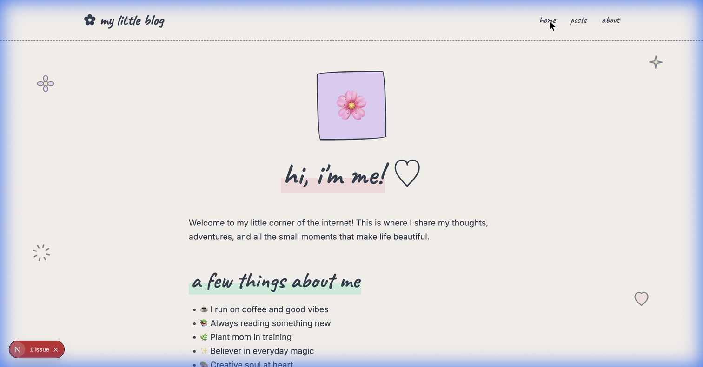

# ✿ My Little Blog

A beautiful, sketchy pastel blog with a hand-drawn aesthetic. Built with Next.js and Sanity CMS for easy content management.



## ✨ Features

- **Sketchy Design** - Hand-drawn borders, wobbly effects, and playful doodles
- **Pastel Colors** - Soft pinks, lavenders, mints, and cream tones
- **Handwritten Typography** - Uses Caveat font for a personal touch
- **Floating Doodles** - Animated hearts, stars, flowers, and sparkles
- **Smooth Animations** - Page transitions and hover effects with Framer Motion
- **Easy Content Management** - Built-in Sanity Studio at `/studio`
- **Image Support** - Automatic image optimization and uploads
- **Responsive** - Looks great on all devices

## 🚀 Quick Start

### 1. Install Dependencies
```bash
npm install
```

### 2. Set Up Sanity

1. Go to [sanity.io/manage](https://sanity.io/manage) and create a new project
2. Copy your **Project ID**
3. Update `.env.local`:

```env
NEXT_PUBLIC_SANITY_PROJECT_ID=your_actual_project_id
NEXT_PUBLIC_SANITY_DATASET=production
```

### 3. Run Development Server
```bash
npm run dev
```

Visit:
- **Blog**: [http://localhost:3000](http://localhost:3000)
- **Write Posts**: [http://localhost:3000/studio](http://localhost:3000/studio)

## 📝 Writing Blog Posts

1. Open [localhost:3000/studio](http://localhost:3000/studio)
2. Log in with your Sanity account
3. Click **Post** → **Create new**
4. Write your post, add images, and click **Publish**!

## 🎨 Customization

### Colors
Edit the CSS variables in `src/app/globals.css`:

```css
:root {
  --pastel-pink: #FFE4E6;
  --pastel-lavender: #E9D5FF;
  --pastel-mint: #D1FAE5;
  /* ... more colors */
}
```

### Blog Name & Logo
Update the navigation in `src/components/Navigation.tsx`:

```tsx
<Link href="/" className="nav-logo">
  ✿ your blog name
</Link>
```

### About Page
Edit `src/app/about/page.tsx` with your personal info.

## 🌐 Deploy to Vercel

1. Push to GitHub
2. Connect repo to [Vercel](https://vercel.com)
3. Add environment variables:
   - `NEXT_PUBLIC_SANITY_PROJECT_ID`
   - `NEXT_PUBLIC_SANITY_DATASET`
4. Deploy! 🎉

## 📁 Project Structure

```
gf-blog/
├── src/
│   ├── app/
│   │   ├── page.tsx          # Homepage
│   │   ├── about/            # About page
│   │   ├── blog/             # Blog listing & posts
│   │   └── studio/           # Sanity CMS editor
│   └── components/
│       ├── Navigation.tsx
│       ├── BlogCard.tsx
│       ├── DoodleDecorations.tsx
│       └── Footer.tsx
├── sanity/
│   ├── schemas/              # Content models
│   └── lib/                  # Sanity client
└── globals.css               # Design system
```

## 💕 Made with love

Built with Next.js, Sanity, and Framer Motion.
